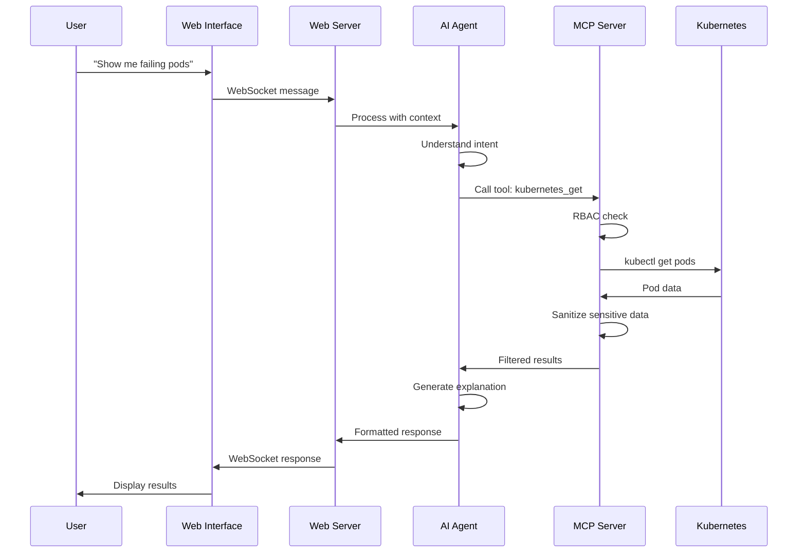

# mcp-lab

# MCP DevOps Agent: A Comprehensive Teaching Guide

## Table of Contents
1. [Executive Summary](#executive-summary)
2. [Understanding the Problem](#understanding-the-problem)
3. [Core Concepts](#core-concepts)
4. [Architecture Deep Dive](#architecture-deep-dive)
5. [Implementation Walkthrough](#implementation-walkthrough)
6. [Enterprise Considerations](#enterprise-considerations)
7. [Integration with Agentic Frameworks](#integration-with-agentic-frameworks)
8. [Teaching Points](#teaching-points)
9. [Hands-On Lab Exercises](#hands-on-lab-exercises)
10. [Real-World Use Cases](#real-world-use-cases)

---

## Executive Summary

This demonstration implements an AI-powered DevOps agent using the Model Context Protocol (MCP) to safely interact with Kubernetes infrastructure through natural language. It showcases how modern AI agents can bridge the gap between human intent and complex technical operations while maintaining security, auditability, and reliability.

### What Students Will Learn
- **AI Agent Architecture**: How to build production-ready AI agents
- **Protocol Design**: Understanding MCP and why protocols matter
- **Safety Engineering**: Implementing RBAC, validation, and sandboxing
- **System Integration**: Connecting AI with real infrastructure
- **Enterprise Patterns**: Scaling from POC to production

---

## Understanding the Problem

### The DevOps Complexity Challenge

Modern DevOps engineers face several challenges:

1. **Tool Proliferation**: kubectl, helm, prometheus, grafana, terraform, ansible, etc.
2. **Context Switching**: Different CLIs, APIs, and interfaces
3. **Knowledge Barriers**: New team members need months to learn all tools
4. **Error-Prone Operations**: One wrong command can bring down production
5. **Audit Complexity**: Tracking who did what, when, and why

### Traditional Solutions vs. Agent Approach

**Traditional Approach:**
```bash
# Developer needs to know exact syntax
kubectl get pods -n production -o json | jq '.items[] | select(.status.phase!="Running")'
kubectl logs -n production app-pod-xyz --tail=100 | grep ERROR
kubectl describe deployment -n production api-server
```

**Agent Approach:**
```
Human: "What's wrong with the API server in production?"
Agent: *Understands intent* → *Executes safely* → *Explains clearly*
```

### Why AI Agents Matter

AI agents solve real problems:
- **Accessibility**: Junior developers can perform senior-level operations
- **Safety**: Agents enforce policies that humans might forget
- **Consistency**: Same operation performed the same way every time
- **Documentation**: Every action is logged with context
- **Learning**: Agents can explain what they're doing and why

---

## Core Concepts

### 1. What is an AI Agent?

An AI agent is an autonomous system that:
- **Perceives** its environment (reads cluster state)
- **Reasons** about actions (uses LLM for decision making)
- **Acts** on the environment (executes kubectl commands)
- **Learns** from interactions (improves over time)

Key characteristics:
- **Goal-Oriented**: Works toward specific objectives
- **Autonomous**: Makes decisions without constant human input
- **Adaptive**: Adjusts behavior based on context
- **Interactive**: Communicates naturally with humans

### 2. Model Context Protocol (MCP)

MCP is an open protocol standardizing how AI agents interact with external systems.

**Key Components:**
- **Tools**: Discrete capabilities an agent can use
- **Resources**: Data sources the agent can access
- **Prompts**: Reusable interaction templates
- **Sampling**: Controlled text generation

**Why MCP Matters:**
- **Standardization**: One protocol for all integrations
- **Safety**: Built-in validation and sandboxing
- **Composability**: Tools can be mixed and matched
- **Auditability**: All operations are logged

### 3. The Agent-Protocol-Infrastructure Stack

```
┌─────────────────┐
│   Human User    │ Natural Language
└────────┬────────┘
         │
┌────────▼────────┐
│    AI Agent     │ Reasoning Layer
│   (GPT-4/LLM)   │
└────────┬────────┘
         │
┌────────▼────────┐
│  MCP Protocol   │ Safety Layer
│   (JSON-RPC)    │
└────────┬────────┘
         │
┌────────▼────────┐
│ Infrastructure  │ Execution Layer
│  (Kubernetes)   │
└─────────────────┘
```

---

## Architecture Deep Dive

### Component Responsibilities

#### 1. Web Interface (`web_interface.html`)
- **Purpose**: User interaction point
- **Technology**: HTML5, WebSocket
- **Responsibilities**:
  - Capture user input
  - Display responses
  - Maintain conversation context
  - Real-time updates

#### 2. Web Server (`web_server.py`)
- **Purpose**: Bridge between frontend and backend
- **Technology**: Flask, SocketIO
- **Responsibilities**:
  - WebSocket management
  - Session handling
  - Request routing
  - Response formatting

#### 3. AI Agent (`agent.py`)
- **Purpose**: Intelligence layer
- **Technology**: OpenAI GPT-4
- **Responsibilities**:
  - Natural language understanding
  - Intent recognition
  - Tool selection
  - Response generation

#### 4. MCP Server (`server.py`)
- **Purpose**: Safe execution environment
- **Technology**: Python asyncio, JSON-RPC
- **Responsibilities**:
  - Tool discovery
  - RBAC enforcement
  - Command execution
  - Result sanitization

### Data Flow Analysis



### Security Layers

1. **Authentication Layer** (not implemented in POC)
   - User authentication
   - Session management
   - Token validation

2. **Authorization Layer** (RBAC)
   - Role-based access control
   - Tool-level permissions
   - Namespace restrictions

3. **Validation Layer**
   - Input sanitization
   - Command validation
   - Parameter checking

4. **Execution Layer**
   - Sandboxed execution
   - Timeout controls
   - Resource limits

---

## Implementation Walkthrough

### Setting Up the Environment

The POC requires:
- **Kubernetes**: Real cluster for operations
- **Python 3.12**: Modern async support
- **OpenAI API**: LLM for reasoning
- **Kind**: Local Kubernetes for testing

### Key Implementation Details

#### 1. Tool Discovery Pattern
```python
async def discover_tools(self):
    """Dynamic tool discovery"""
    tools = await self.mcp_client.list_tools()
    for tool in tools:
        self.available_tools[tool["name"]] = {
            "description": tool["description"],
            "schema": tool["inputSchema"]
        }
```

**Teaching Point**: Dynamic discovery allows agents to adapt to new capabilities without code changes.

#### 2. RBAC Implementation
```python
def can_execute(self, user: str, tool: str) -> bool:
    role = self.user_roles.get(user, "viewer")
    return tool in self.roles.get(role, [])
```

**Teaching Point**: Every operation must pass through policy checks.

#### 3. Safe Command Execution
```python
async def execute_kubernetes_get(self, args):
    # Timeout protection
    stdout, stderr = await asyncio.wait_for(
        process.communicate(), 
        timeout=30
    )
    # Sensitive data removal
    sanitized_data = self.sanitize_k8s_data(raw_data)
```

**Teaching Point**: Never trust external command execution - always sanitize and timeout.

---

## Enterprise Considerations

### Moving from POC to Production

#### 1. Authentication & Authorization
**Current POC**: Simple role mapping
**Enterprise Need**: 
- Integration with LDAP/AD/OIDC
- Multi-factor authentication
- Fine-grained permissions
- Audit logging

**Implementation**:
```python
# Enterprise authentication
from enterprise_auth import OIDCProvider

class EnterpriseRBAC:
    def __init__(self):
        self.auth_provider = OIDCProvider(
            issuer="https://auth.company.com",
            client_id="mcp-agent"
        )
    
    async def authenticate(self, token):
        claims = await self.auth_provider.verify(token)
        return User(
            id=claims['sub'],
            roles=claims['roles'],
            namespaces=claims['namespaces']
        )
```

#### 2. High Availability
**Current POC**: Single instance
**Enterprise Need**: 
- Multiple replicas
- Load balancing
- Session persistence
- Failover

**Architecture**:
```yaml
apiVersion: apps/v1
kind: Deployment
metadata:
  name: mcp-agent
spec:
  replicas: 3
  strategy:
    type: RollingUpdate
  template:
    spec:
      containers:
      - name: mcp-agent
        resources:
          requests:
            memory: "512Mi"
            cpu: "500m"
          limits:
            memory: "1Gi"
            cpu: "1000m"
```

#### 3. Observability
**Current POC**: Basic logging
**Enterprise Need**:
- Distributed tracing
- Metrics collection
- Log aggregation
- Alerting

**Implementation**:
```python
from opentelemetry import trace
from prometheus_client import Counter, Histogram

# Metrics
tool_executions = Counter('mcp_tool_executions_total', 
                         'Total tool executions',
                         ['tool', 'user', 'status'])
execution_duration = Histogram('mcp_execution_duration_seconds',
                              'Execution duration',
                              ['tool'])

# Tracing
tracer = trace.get_tracer(__name__)

@trace_async
async def execute_tool(self, tool_name, args):
    with tracer.start_as_current_span("execute_tool") as span:
        span.set_attribute("tool.name", tool_name)
        span.set_attribute("user.id", args.get("user"))
        # ... execution logic
```

#### 4. Compliance & Governance
**Requirements**:
- SOC2 compliance
- GDPR requirements
- Change management
- Disaster recovery

**Implementation Checklist**:
- [ ] Encrypt all data in transit (TLS 1.3)
- [ ] Encrypt all data at rest
- [ ] Implement data retention policies
- [ ] Regular security audits
- [ ] Penetration testing
- [ ] Business continuity planning

---

## Integration with Agentic Frameworks

### 1. LangChain Integration

```python
from langchain.agents import Tool, AgentExecutor
from langchain.agents import create_openai_functions_agent

class MCPToolWrapper(Tool):
    """Wrap MCP tools for LangChain"""
    
    def __init__(self, mcp_client, tool_name):
        self.mcp_client = mcp_client
        self.tool_name = tool_name
        super().__init__(
            name=tool_name,
            func=self._execute,
            description=self._get_description()
        )
    
    async def _execute(self, args):
        return await self.mcp_client.call_tool(
            self.tool_name, 
            json.loads(args)
        )

# Create LangChain agent with MCP tools
tools = [MCPToolWrapper(mcp_client, name) 
         for name in available_tools]
agent = create_openai_functions_agent(llm, tools, prompt)
```

### 2. AutoGen Integration

```python
from autogen import AssistantAgent, UserProxyAgent

class MCPAssistant(AssistantAgent):
    """AutoGen assistant with MCP capabilities"""
    
    def __init__(self, mcp_client, **kwargs):
        super().__init__(**kwargs)
        self.mcp_client = mcp_client
        self.register_tools()
    
    def register_tools(self):
        for tool in self.mcp_client.tools:
            self.register_function(
                function_map={tool.name: tool.execute}
            )

# Multi-agent system
devops_assistant = MCPAssistant(
    name="DevOps_Assistant",
    mcp_client=mcp_client
)
security_reviewer = AssistantAgent(
    name="Security_Reviewer",
    system_message="Review all operations for security"
)
```

### 3. CrewAI Integration

```python
from crewai import Agent, Task, Crew

class MCPAgent(Agent):
    """CrewAI agent with MCP tools"""
    
    def __init__(self, mcp_client, **kwargs):
        super().__init__(**kwargs)
        self.mcp_client = mcp_client
        self.tools = self._create_tools()
    
    def _create_tools(self):
        return [
            StructuredTool.from_function(
                func=lambda **kwargs: self.mcp_client.call_tool(name, kwargs),
                name=name,
                description=desc
            )
            for name, desc in self.mcp_client.get_tools().items()
        ]

# Create a crew
devops_crew = Crew(
    agents=[
        MCPAgent(role="SRE", goal="Maintain cluster health"),
        MCPAgent(role="Security", goal="Ensure compliance")
    ],
    tasks=[
        Task(description="Check cluster status"),
        Task(description="Scan for vulnerabilities")
    ]
)
```

### 4. Custom Orchestrator Pattern

```python
class AgentOrchestrator:
    """Custom orchestration for complex workflows"""
    
    def __init__(self):
        self.agents = {}
        self.workflows = {}
    
    def register_agent(self, name, agent):
        self.agents[name] = agent
    
    async def execute_workflow(self, workflow_name, context):
        workflow = self.workflows[workflow_name]
        
        for step in workflow.steps:
            agent = self.agents[step.agent]
            
            # Pre-execution hooks
            await self.before_execution(step, context)
            
            # Execute with retry logic
            result = await self.execute_with_retry(
                agent, step.action, context
            )
            
            # Post-execution validation
            await self.after_execution(step, result, context)
            
            # Update context for next step
            context.update(result)
        
        return context
```

---

## Teaching Points

### Lesson 1: Why Agents Need Protocols

**Key Concept**: Agents without protocols are dangerous.

**Demonstration**:
```python
# Dangerous: Direct execution
async def unsafe_agent(user_input):
    command = f"kubectl {user_input}"  # NO! Command injection
    os.system(command)  # NO! Uncontrolled execution

# Safe: Protocol-mediated execution
async def safe_agent(user_input):
    intent = await llm.understand(user_input)
    tool = await select_tool(intent)
    if await rbac.can_execute(user, tool):
        result = await mcp.execute_tool(tool, validated_args)
```

**Discussion Points**:
- What could go wrong with direct execution?
- How does MCP prevent these issues?
- What other protocols exist? (REST, GraphQL, gRPC)

### Lesson 2: The Importance of Context

**Key Concept**: Agents need context to make good decisions.

**Exercise**: Implement context tracking
```python
class ContextManager:
    def __init__(self):
        self.conversation_history = []
        self.user_preferences = {}
        self.system_state = {}
    
    def update(self, event):
        # Students implement this
        pass
    
    def get_relevant_context(self, query):
        # Students implement this
        pass
```

### Lesson 3: Safety Engineering

**Key Concept**: Every agent action must be safe by default.

**Checklist for Students**:
- [ ] Input validation
- [ ] Output sanitization
- [ ] Timeout controls
- [ ] Resource limits
- [ ] Audit logging
- [ ] Error handling
- [ ] Rollback capability

### Lesson 4: Observability

**Key Concept**: You can't improve what you can't measure.

**Implementation Exercise**:
```python
class ObservableAgent:
    def __init__(self):
        self.metrics = {
            'total_requests': 0,
            'successful_executions': 0,
            'failed_executions': 0,
            'average_response_time': 0
        }
    
    @measure_time
    @log_execution
    @trace_span
    async def execute(self, request):
        # Students add observability
        pass
```

---

## Hands-On Lab Exercises

### Lab 1: Build Your First MCP Tool (30 mins)

**Objective**: Create a custom tool for disk usage monitoring.

**Starter Code**:
```python
class DiskUsageTool:
    name = "disk_usage"
    description = "Check disk usage across nodes"
    
    async def execute(self, args):
        # Students implement:
        # 1. Get node list
        # 2. Check disk usage per node
        # 3. Alert if > 80%
        pass
```

### Lab 2: Implement RBAC (45 mins)

**Objective**: Add a new role with custom permissions.

**Tasks**:
1. Create "developer" role
2. Allow read-only access to dev/staging
3. Deny production access
4. Test with different users

### Lab 3: Add Caching Layer (45 mins)

**Objective**: Improve performance with intelligent caching.

**Requirements**:
- Cache expensive Prometheus queries
- Implement cache invalidation
- Add cache metrics
- Handle cache misses gracefully

### Lab 4: Multi-Agent Collaboration (60 mins)

**Objective**: Create two agents that work together.

**Scenario**:
- Agent 1: Monitors cluster health
- Agent 2: Performs remediation
- They must communicate and coordinate

---

## Real-World Use Cases

### Use Case 1: Incident Response

**Scenario**: Production API is returning 500 errors.

**Traditional Approach**: 
- SSH into servers
- Check multiple log files
- Query Prometheus
- Check deployment status
- 30-45 minutes to resolution

**Agent Approach**:
```
Human: "The API is returning 500s, investigate and fix"
Agent: 
1. Checking API pod status... 3/5 pods are CrashLooping
2. Analyzing logs... OutOfMemory errors detected
3. Checking recent deployments... New version deployed 2 hours ago
4. Recommendation: Roll back to previous version
5. Executing rollback... Complete
6. Verification: All pods healthy, error rate dropping
Total time: 3 minutes
```

### Use Case 2: Capacity Planning

**Agent Capabilities**:
- Analyze historical resource usage
- Predict future needs
- Recommend scaling actions
- Generate cost estimates

### Use Case 3: Security Compliance

**Agent Workflow**:
1. Scan for CIS benchmarks
2. Identify non-compliant resources
3. Generate remediation scripts
4. Track compliance over time

### Use Case 4: Onboarding Automation

**New Developer Says**: "Set up my access to the development environment"

**Agent Actions**:
1. Creates namespace
2. Sets up RBAC
3. Deploys sample application
4. Configures monitoring
5. Sends welcome email with credentials

---

## Enterprise Implementation Roadmap

### Phase 1: Proof of Concept (Current)
- Basic functionality
- Single cluster
- Limited tools
- Manual deployment

### Phase 2: Pilot Program (Months 1-3)
- Add authentication
- Integrate with corporate LDAP
- Deploy to staging environment
- Train pilot users
- Gather feedback

### Phase 3: Production Rollout (Months 4-6)
- High availability setup
- Full observability
- Disaster recovery
- Security audit
- Documentation

### Phase 4: Scale & Enhance (Months 7-12)
- Multi-cluster support
- Advanced AI features
- Custom tool development
- Integration with CI/CD
- Cost optimization features

---

## Common Pitfalls and Solutions

### Pitfall 1: Over-Trusting the AI
**Problem**: Assuming AI always makes correct decisions
**Solution**: Always validate AI actions, implement approval workflows for critical operations

### Pitfall 2: Insufficient Context
**Problem**: Agent lacks information to make good decisions
**Solution**: Rich context management, conversation history, system state tracking

### Pitfall 3: Poor Error Handling
**Problem**: Agent fails silently or cryptically
**Solution**: Comprehensive error handling, user-friendly error messages, fallback strategies

### Pitfall 4: Security as Afterthought
**Problem**: Adding security after implementation
**Solution**: Security-first design, threat modeling, regular audits

---

## Assessment Questions for Students

1. **Conceptual Understanding**
   - Why is MCP necessary? Why not just call kubectl directly?
   - What are the trade-offs between safety and flexibility?
   - How would you handle a malicious user trying to exploit the system?

2. **Technical Implementation**
   - Implement a new tool for database backup
   - Add rate limiting to prevent abuse
   - Create a testing framework for MCP tools

3. **Architecture & Design**
   - Design a multi-region deployment strategy
   - How would you handle 10,000 concurrent users?
   - Propose a disaster recovery plan

4. **Real-World Application**
   - How would you adapt this for a financial services company?
   - What changes needed for healthcare compliance?
   - Design an agent for your organization

---

## Resources and Further Reading

### Essential Documentation
- [MCP Specification](https://modelcontextprotocol.io)
- [OpenAI Function Calling](https://platform.openai.com/docs/guides/function-calling)
- [Kubernetes RBAC](https://kubernetes.io/docs/reference/access-authn-authz/rbac/)

### Related Projects
- LangChain - Framework for LLM applications
- AutoGen - Microsoft's multi-agent framework
- CrewAI - Multi-agent orchestration
- Semantic Kernel - Microsoft's AI orchestration

### Academic Papers
- "Constitutional AI: Harmlessness from AI Feedback"
- "ReAct: Synergizing Reasoning and Acting in Language Models"
- "Toolformer: Language Models Can Teach Themselves to Use Tools"

### Industry Best Practices
- OWASP Top 10 for LLM Applications
- Google's Responsible AI Practices
- Microsoft's AI Security Guidelines

---

## Conclusion

This MCP DevOps Agent demonstrates the convergence of AI and infrastructure operations. It shows how thoughtful protocol design, safety engineering, and user experience can create powerful tools that democratize complex operations while maintaining security and reliability.

The future of DevOps is not about replacing humans with AI, but augmenting human capabilities with intelligent agents that handle routine tasks, enforce best practices, and enable teams to focus on innovation rather than operations.

### Key Takeaways

1. **Protocols Enable Safety**: MCP provides the guardrails needed for safe AI-infrastructure interaction
2. **Context is King**: Rich context enables better agent decisions
3. **Security by Design**: Security must be built-in, not bolted-on
4. **Observability is Essential**: You must measure to improve
5. **Start Small, Think Big**: POCs should have clear paths to production

### Next Steps for Students

1. **Experiment**: Modify the POC, add new tools, break things and fix them
2. **Extend**: Add authentication, implement caching, improve error handling
3. **Integrate**: Connect with your organization's tools and workflows
4. **Share**: Document your learnings, contribute to open source
5. **Innovate**: Think about new use cases and applications

The age of AI agents is just beginning. The engineers who understand how to build, deploy, and manage these systems safely will be the architects of tomorrow's infrastructure.
